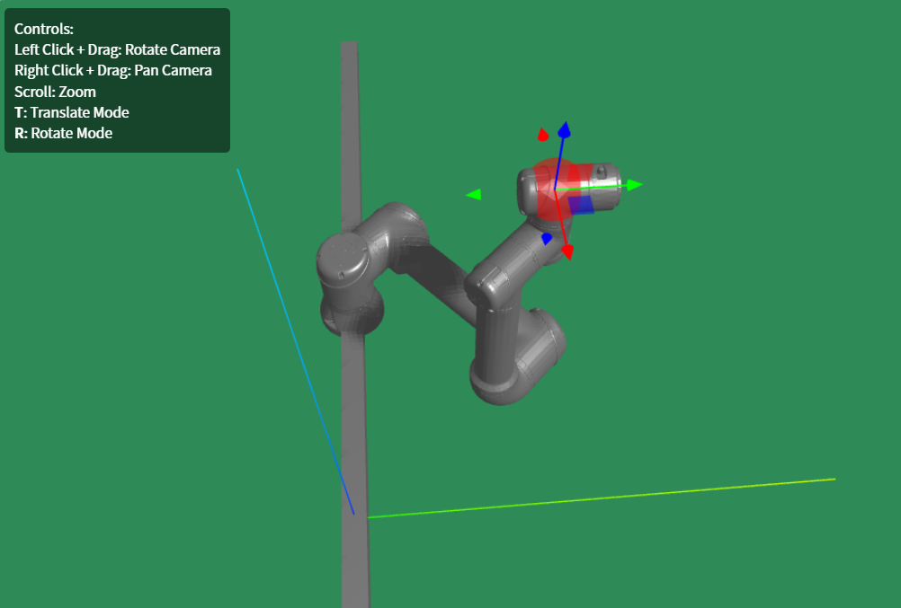
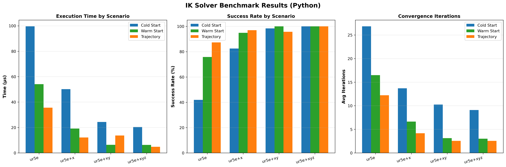

# Kinex

[](LICENSE)
[](https://pypi.org/project/kinex/)
[](https://www.npmjs.com/package/@daoming.chen/kinex)

[中文文档](README_zh.md) | [Documentation](docs/) | [Examples](examples/)

A modern C++20 robotics kinematics library with Python and WebAssembly bindings for browser-based robotics applications.

## ✨ Features

- 🚀 **High Performance**: Analytical Jacobian computation 5-10x faster than automatic differentiation
- 🎯 **Inverse Kinematics**: SQP-based solver with joint limit constraints (~100-300µs per solve)
- 🌐 **WebAssembly Support**: Run kinematics in the browser with near-native performance
- 🐍 **Python Bindings**: Easy-to-use Python API with NumPy integration
- 📊 **Production Ready**: Comprehensive benchmarks and test coverage
- 🎨 **3D Visualization**: Interactive Three.js examples for robot visualization

## 🎬 Live Demo

Try the interactive UR5 robot visualization: [**Live Demo**](https://daoming-chen.github.io/Kinex/)



## 📦 Quick Install

### Python (via pip)

```bash
pip install kinex
```

### JavaScript/TypeScript (via npm)

```bash
npm install @daoming.chen/kinex
```

## 🚀 Quick Start

### Python Example

```python
import kinex
import numpy as np

# Load robot from URDF (Unified API)
robot = kinex.Robot.from_urdf("ur5e.urdf", "tool0")

# Forward kinematics
joint_angles = np.array([0.0, -1.57, 0.0, 0.0, 0.0, 0.0])
pose = robot.forward_kinematics(joint_angles)
print(f"Position: {pose.translation()}")

# Inverse kinematics
target_pose = ... # Transform object
solution, status = robot.inverse_kinematics(target_pose, q_init=np.zeros(6))
if status.converged:
    print(f"Joint solution: {solution}")
```

### JavaScript/WebAssembly Example

```javascript
import createKinexModule from '@daoming.chen/kinex';

// Initialize WASM module
const kinex = await createKinexModule();

// Load robot from URDF string (Unified API)
const robot = kinex.Robot.fromURDFString(urdfContent, "tool0");

// Compute forward kinematics
const pose = robot.forwardKinematics([0.0, -1.57, 0.0, 0.0, 0.0, 0.0]);
console.log('Position:', pose.position);

// Solve inverse kinematics
const targetPose = {
  position: [0.5, 0.0, 0.5],
  quaternion: [1.0, 0.0, 0.0, 0.0]
};
const result = robot.inverseKinematics(targetPose, [0.0, 0.0, 0.0, 0.0, 0.0, 0.0]);
console.log('Solution:', result.solution);
```

## 📊 Performance

Kinex is designed for production use with excellent performance characteristics:



*IK solver performance across real-world robots showing solve times, iteration counts, and success rates.*

**Key Metrics:**
- ⚡ **Cold Start IK**: ~100-300µs per solve
- 🔥 **Warm Start IK**: ~50-150µs per solve
- 📐 **Jacobian Computation**: <5µs (analytical)
- ✅ **Success Rate**: >99% convergence
- 🌐 **WebAssembly**: Near-native performance

See [detailed benchmarks](docs/benchmarks/) for more information.

## 📖 Documentation

- [Getting Started](docs/guides/getting-started.md) - Installation and basic usage
- [Python API](docs/api/python.md) - Python bindings reference
- [C++ Tutorial](docs/tutorials/cpp-tutorial.md) - C++ usage examples
- [Building from Source](docs/guides/building.md) - Compilation instructions
- [Benchmarks](docs/benchmarks/) - Performance analysis

## 🛠️ Building from Source

```bash
# Clone with submodules
git clone --recursive https://github.com/Daoming-Chen/kinex.git
cd kinex

# Build C++ library
cmake -B build -DCMAKE_BUILD_TYPE=Release
cmake --build build -j

# Install
sudo cmake --install build
```

For platform-specific instructions, see the [build guide](docs/guides/building.md).

## 🗺️ Roadmap

- ✅ URDF parsing
- ✅ Forward kinematics
- ✅ Analytical Jacobian computation
- ✅ Inverse kinematics (SQP solver)
- ✅ WebAssembly bindings
- ✅ Performance benchmarks
- ✅ Three.js visualization examples
- ✅ Python bindings
- 🚧 Full-featured web application
- 🔜 Collision detection ([COAL](https://github.com/coal-library/coal) integration)
- 🔜 Multi-solution IK ([IKFlow](https://github.com/jstmn/ikflow) integration)
- 🔜 Cartesian path tracking ([RelaxedIK](https://github.com/uwgraphics/relaxed_ik_core)-inspired)
- 🔜 ROS2 integration

## 📄 License

This project is licensed under the MIT License - see the [LICENSE](LICENSE) file for details.

## 🙏 Acknowledgments

- **Eigen** - Fast linear algebra library
- **DaQP** - Efficient quadratic programming solver
- **pugixml** - Lightweight XML parser for URDF parsing
- **nanobind** - Efficient C++/Python bindings
- **spdlog** - Fast C++ logging library
- **GoogleTest** - C++ testing framework
- **Emscripten** - WebAssembly compilation toolchain

## 📧 Support

- 🐛 [GitHub Issues](https://github.com/Daoming-Chen/Kinex/issues)
- 📖 [Documentation](docs/)
- 💬 [Discussions](https://github.com/Daoming-Chen/Kinex/discussions)

---

Made with ❤️ for the robotics community